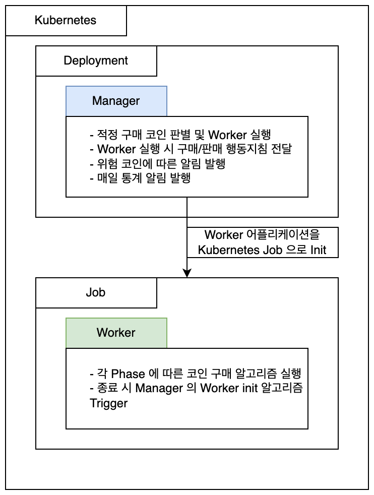

# Project Santa

업비트에서 코인 정보를 불러와 분석 및 자동으로 거래하는 알고리즘입니다.

## 프로젝트 구조

프로젝트에는 4개의 모듈이 있습니다.

### TradeManager
   - 업비트에서 거래 가능한 코인을 불러오고, 알고리즘을 사용해 구매할 코인을 판별합니다.
   - 구매할 코인이 결정되면, TradeWorker 를 Kubernetes Job 을 이용해 띄웁니다.
   - 위험 코인 (1차 거래에서 손실을 입은 코인) 이 일정 개수 이상 쌓일 경우, 사용자에게 알림을 보냅니다.
   - 요청 시, 현재로부터 n 시간만큼의 거래통계를 사용자에게 보냅니다.
     - 해당 기능은 [batch](https://github.com/lutergs-dev/backend-batch) 모듈에서 하루에 한 번씩 호출해 사용자에게 하루 통계를 받게 합니다.

### TradeWorker
   - Manager 가 Worker 를 실행시키면, Manager 가 전달해준 정보 (구매가격, 구매량, Phase 상승/하락 결정 퍼센트 등) 를 이용해 코인을 구매합니다.
   - 정해진 Phase 에 따라 코인을 매도합니다.
     1. Phase 1 : 코인 매수 후 n 분동안 실행됩니다.
         - 매도 (상한) 기준 : 매수가로부터 n % 상승 및 현재 코인 가격이 하락세이면 판매합니다.
         - 매도 (하한) 기준 : 매수가로부터 n % 하락하면 판매합니다.
     2. Phase 2 : Phase 1 종료후 n 분동안 실행됩니다.
         - 매도 (상한) 기준 : 매수가로부터 n % 상승하면 판매합니다.
         - 매도 (하한) 기준 : 매수가로부터 n % 하락하면 판매합니다.
     3. Timeout : Phase 1, 2 가 지나도록 거래가 완료되지 않으면 현재 가격으로 코인을 매도합니다.

### UpbitClient
Manager, Worker 가 업비트와 상호작용할 때 공통적으로 참조하는 라이브러리입니다. WebClient 를 이용해 업비트 공식 API 에 따라 요청을 보내고 응답값을 반환합니다.

### Util
Manager, Worker 가 공통으로 사용하는 도메인 (코인의 1회 거래정보) 에 대한 코드를 담고 있는 유틸성 라이브러리입니다.

## 프로젝트 설명

전체 프로젝트의 flow 는 다음과 같습니다.

1. 사용자가 Worker 의 최소 / 최대 거래가격, Phase 1, 2 의 지속 시간, 상승 / 하한 퍼센트를 Manager 에 설정합니다.
2. Manager 는 Worker 를 실행시키라는 REST API call 을 받으면, 다음과 같은 로직을 따라서 적합한 코인 리스트를 도출합니다.
   1. 업비트 기준 위험하지 않은 코인 필터링
   2. 최근 24시간 거래량 순으로 상위 25개 필터링
   3. 커스텀 거래가능 로직에 따라 거래 가능한 코인 필터링
      - (고가 - 현재가) : (현재가 - 저가) 의 비율이 9:1 이상이면서 고가가 저가보다 먼저 일어난 경우 거래하지 않음.
      - 저가와 현재가가 동일할 경우 거래하지 않음.
      - 현재가가 저가보다 높을 때, (고가 - 저가) : (현재가 - 저가) = 100 : 3 이하인 경우는 거래하지 않음.
      - RSI 지표가 20이하 80 이상인 것은 거래하지 않음.
   4. 다음 우선순위를 통해 코인 정렬
      - 최근 6시간 기준 고가가 저가보다 먼저 발생했고, 저가로부터 현재까지 가격이 꾸준히 상승중인 경우
      - 현재 호가 기준으로 가중치 (가중치는 n호가 (총구매가격 - 총판매가격) 의 ( (15-n) / 15 ) 를 반영함. 즉, 1호가에 가까운 가격일수록 크게 반영) 에 따라 ordering
   5. 사용자가 제시한 Worker 당 거래가격 및 업비트에 있는 총 원화를 토대로 약 2~3배수의 코인 가져옴
   6. 지정 개수만큼 랜덤으로 코인 선택
3. 도출한 코인을 토대로 Manager 는 Worker 를 Kubernetes Job 으로 실행
4. Worker 는 위 상술한 로직대로 거래 진행
   - 거래하면서 1초에 한 번씩 자신이 거래하는 코인의 현재가 확인 및 DB 에 저장
   - Phase 1 의 상승세 / 하락세 판별 시 코인의 가격 history 를 보고 판단
   - 추후 Manager 에서 코인거래 완료 후 그래프를 그려 사용자에게 제공 예정
   - 거래에 변경이 일어날 시 (코인의 매수 / 매도 주문 및 주문 완료 발생시) Manager 에게 해당 정보 송출, Manager 는 정보 저장
   - 거래 완료 후, Manager 에게 2 번에서 설명한 Worker 실행 call 을 날린 뒤 종료

간략한 그림은 다음과 같습니다.

